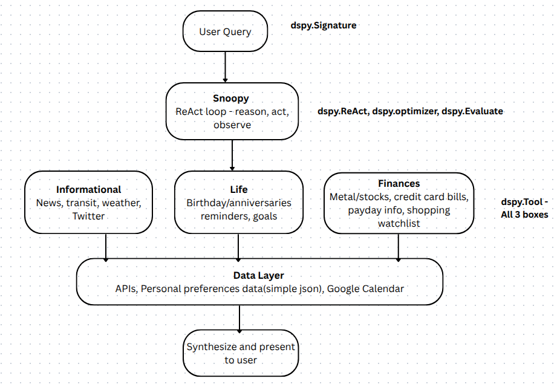

# Snoopy agent using DSPy + DSPy exploration

This repo consists of all the exploration related DSPy which consists of general-purpose modules that makes an attempt to replace prompt engineering (crafting, optimization and evaluation) and traditional vibe checks.

For the building blocks of DSPy i.e. signature composition, modules, optimizers, custom modules and building/optimizing agents using ReAct pattern refer <a href="./cheatsheet_optimizers_react_custom_modules">here </a>

Medium blog post:- TBD

## Snoopy agent - A personal assistant to know your day better than you do
Below is a simple conceptual diagram showing what snoopy does. 

<b>Note that the goal here is to build something useful but also to leverage DSPy capabilities.</b>

##### Folder structure
snoppy_agent/
├── datasets
│   ├── testset.csv
│   └── trainset.csv
├── evals.py
├── main.py
├── optimization.py
├── preferences.json
└── tools
    ├── __init__.py
    ├── informational.py
    ├── finances.py
    └── life.py
