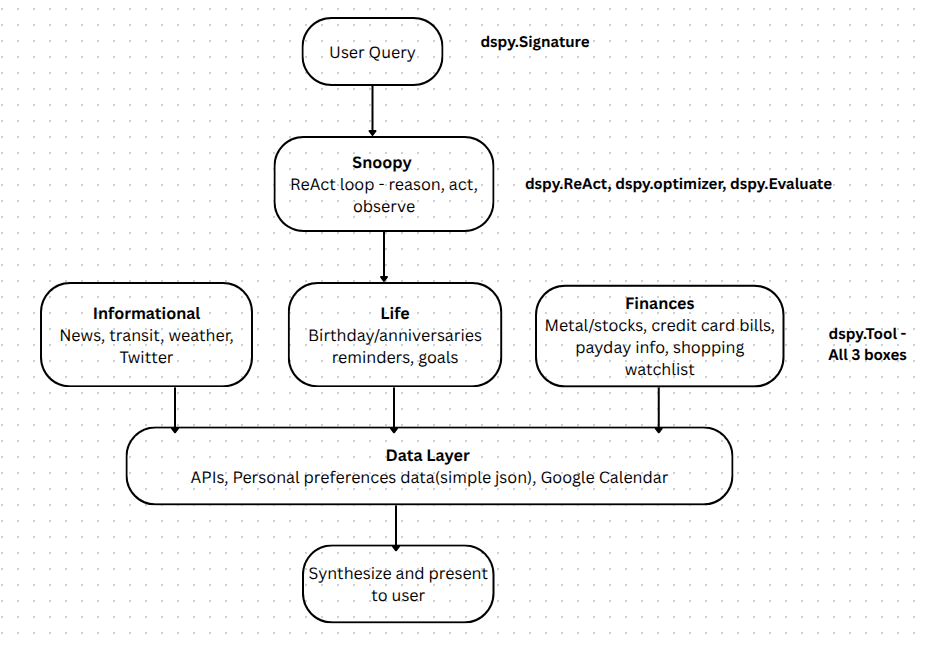

# Snoopy agent using DSPy + DSPy exploration

This repo consists of all the exploration related DSPy which consists of general-purpose modules that makes an attempt to replace prompt engineering (crafting, optimization and evaluation) and traditional vibe checks.

For the building blocks of DSPy i.e. signature composition, modules, optimizers, custom modules and building/optimizing agents using ReAct pattern refer <a href="./cheatsheet_optimizers_react_custom_modules">here </a>

Medium blog post:- TBD


## Snoopy agent - A personal assistant to know your day better than you do
Below is a simple conceptual diagram showing what snoopy does. 



<b>Note that the goal here is to build something useful but also to leverage DSPy capabilities.</b>

##### Folder structure
```
snoppy_agent/
├── datasets
│   ├── testset.csv
│   └── trainset.csv
├── evals.py
├── main.py
├── optimization.py
├── preferences.json
└── tools
    ├── __init__.py
    ├── informational.py
    ├── finances.py
    └── life.py
    |___utils.py
```

## Implementation

### API keys

For weather, news, and viral twitter trends - Tavily search API has been used. Keep in mind that based on your search depth more credits will be used. Monthly you will get 1000 credits

Tavily search - https://www.tavily.com/

PS:- Twitter and Openweather credits are either expensive or require a credit card. Which is honestly an overkill

Google Dev console access - For Google calendar. For more info checkout this <a href="./snoppy_agent/other_info/google_calendar_access.md"> out.

For financial tools, yfinance is used. Please refer to their terms and conditions before you proceed.

For transit search, I am using web search via LLMs directly rather than Google Maps, for brevity


## Other helpful stuff

Format your files earlier using black

```
black <filename>.py --check #this is to check
black <filename>.oy #this is to actually format your files
```

If youn encounter any issues related to token associated with google calendar like below, simply delete token.json and re-run the service. This happens if you haven't used the token for a while
```
    raise exceptions.RefreshError(
google.auth.exceptions.RefreshError: ('invalid_grant: Token has been expired or revoked.', {'error': 'invalid_grant', 'error_description': 'Token has been expired or revoked.'}))

```

Meta Tooling
Tool description can be reviewed by Claude and ask for its critic to ensure the model anf yourself are on the same page.