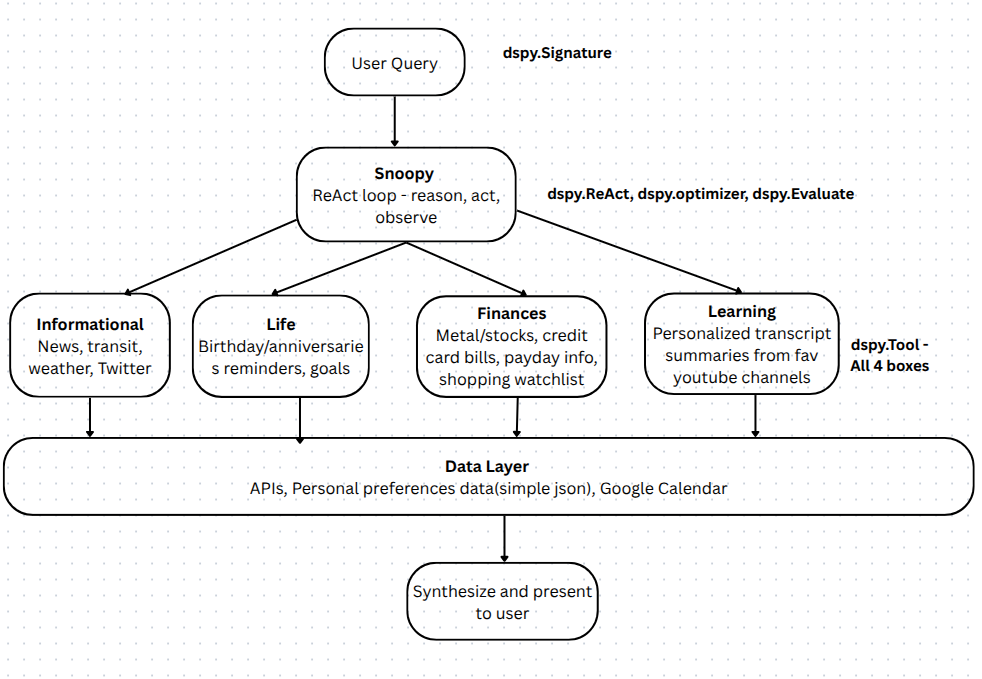
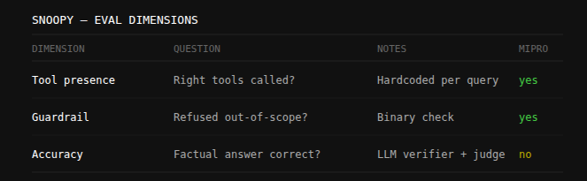

# Snoopy agent using DSPy + DSPy exploration

This repo consists of all the exploration related DSPy which consists of general-purpose modules that makes an attempt to replace prompt engineering (crafting, optimization and evaluation) and traditional vibe checks.

For the building blocks of DSPy i.e. signature composition, modules, optimizers, custom modules and building/optimizing agents using ReAct pattern refer <a href="./cheatsheet_optimizers_react_custom_modules">here </a>

Medium blog post:- TBD


## Snoopy agent - A personal assistant to know your day better than you do
Below is a simple conceptual diagram showing what snoopy does. 



<b>Note that the goal here is to build something useful but also to leverage DSPy capabilities.</b>

##### Folder structure
```
snoppy_agent/
├── accuracy_eval
│   └── eval1.json
├── credentials.json
├── datasets
│   ├── accuracy_data.py
│   ├── __init__.py
│   ├── testset.py
│   └── trainset.py
├── evals.py
├── final_results_log.md
├── impressive_results
│   └── reuse_existing_tools
│       ├── 1.png
│       ├── 2.png
│       ├── 3.png
│       ├── 4.png
│       └── 5.png
├── main.py
├── optimization.py
├── other_info
│   ├── google_calendar_access.md
│   ├── youtube_data_api.md
│   └── youtube_ip_ban.md
├── preferences.json
├── token.json
├── tools
│   ├── finances.py
│   ├── informational.py
│   ├── __init__.py
│   ├── learn.py
│   ├── life.py
│   └── utils.py
├── tuning_results
│   ├── baseline_results_excluded_youtube_examples_final.json
│   ├── prompts
│   │   ├── baseline_prompt.txt
│   │   └── optimized_prompt.txt
│   ├── testset_baseline_results_excluded_youtube_examples.json
│   ├── tuned_agents
│   │   └── optimized_snoopy.json
│   └── tuned_results_excluded_youtube_examples_final.json
└── youtube_cookies.txt
```

## Implementation

### API keys

For weather, news, and viral twitter trends - Tavily search API has been used. Keep in mind that based on your search depth more credits will be used. Monthly you will get 1000 credits

Tavily search - https://www.tavily.com/

PS:- Twitter and Openweather credits are either expensive or require a credit card. Which is honestly an overkill

Google Dev console access - For Google calendar. For more info checkout this <a href="./snoppy_agent/other_info/google_calendar_access.md"> out.

For financial tools, yfinance is used. Please refer to their terms and conditions before you proceed.

For transit search, I am using web search via LLMs directly rather than Google Maps, for brevity.

For Youtube Data API v3, Refer to Google Dev console. Note:- You will get 10K daily limit. However, some calls we take 100 of those
credits. So use it efficiently. Which is the rationale for hard-coding channel_id

## Testing framework



Given that accuracy evaluation in this scenario is very time-based, I have opted to do a LLM as ajudge approach withy an independent ground truth generation using web search from other LLM providers. Results of accuracy evaluation can be found here <a href="./snoppy_agent/accuracy_eval/eval1.json">

## Prompt Optimizaation using DsPy's MIPROv2
The guardrail aspect and the tool calling aspect of Snoopy has been used for this purpose as incorporating subjective score from accuracy without actually providing rationale from judge for optimization seems less useful. Check out this <a href="./snoppy_agent/final_results_log.md"> for the full trace.

Long story short, MIPROv2 did not improve the optimized agent's performance on the test set. 
But this is natural in hyperparameter tuning — you hit a ceiling when the baseline is already 
strong. It also raises a fair question: what is the point of DSPy when models are getting 
better at handling ambiguous instructions on their own?

The answer lies not in the tuning technique but in the quality and difficulty of the training 
data. A capable model on easy examples leaves nothing to optimize. The real value of DSPy shows 
up when your task is genuinely hard, your baseline is weak, or you need a cheaper model to 
punch above its weight.


## Other helpful stuff

Format your files earlier using black

```
black <filename>.py --check #this is to check
black <filename>.oy #this is to actually format your files
```

If youn encounter any issues related to token associated with google calendar like below, simply delete token.json and re-run the service. This happens if you haven't used the token for a while
```
    raise exceptions.RefreshError(
google.auth.exceptions.RefreshError: ('invalid_grant: Token has been expired or revoked.', {'error': 'invalid_grant', 'error_description': 'Token has been expired or revoked.'}))

```

Check out this <a href="./snoppy_agent/other_info/youtube_ip_ban.md"> on how to mitigate IP bans from youtube when pulling transcripts from youtube


## Other things to try - Meta Tooling
Tool description can be reviewed by Claude and ask for its critic to ensure the model and yourself are on the same page.